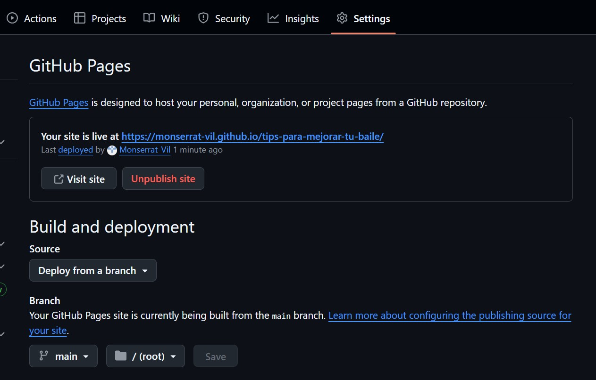
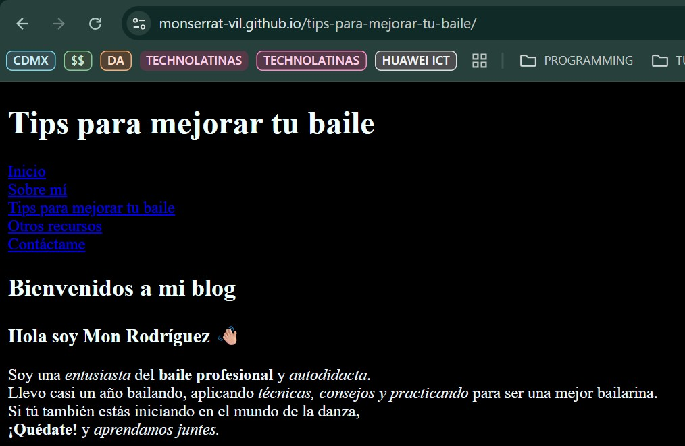
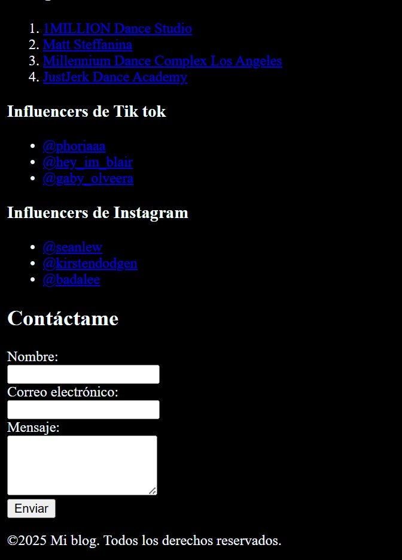
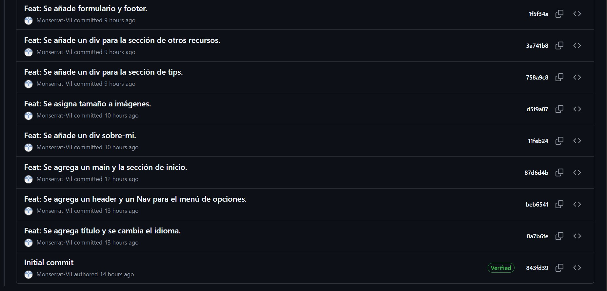

# Evidencias

1. Captura de pantalla de Settings → Pages mostrando la URL activa.

1. 1–2 capturas del sitio abierto en el navegador.

2. Sección “Aprendizajes” respondiendo brevemente: 
- ¿Qué fue lo más fácil y lo más retador?

Lo más *fácil* fue escribir la sintaxis con la ayuda de Visual Studio Code. Es una de mis IDEs favoritas. Mientras que considero que lo más *retador* es realizar los commits, usar css y dominar las etiquetas y atributos de html. 
- ¿Qué etiquetas semánticas usaste y por qué?

Utilize **header** para representar la cabecera de la página. También utilicé **nav** para los menús del blog. Algunas otras etiquetas semánticas que use fueron **main, footer y section** para contener el contenido principal del documento, para representar el pie de página y para definir una sección genérica del documento. 

- ¿Cómo organizaste tus commits?
Los organicé de acuerdo a los cambios más importantes, por secciones y por creaciones de nuevo contenido. 

- ¿Qué mejorarías en la siguiente iteración?
Considero que sería la parte de estilos y algunas nuevas mejoras. 

4. Historial de commits con ≥ 6 commits propios, espaciados en el tiempo y con mensajes claros.

